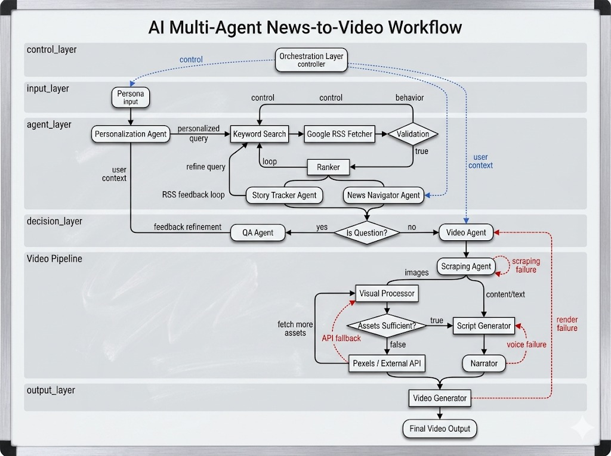

<p align="center">
  
</p>

<h1 align="center">📰 My ET — AI-Native Personalized Newsroom</h1>

<p align="center">
  <b>Your news. Your role. Your language. Zero noise.</b>
</p>

<p align="center">
  
  
  
  
  
  
  
  
</p>

<p align="center">
  Built with ☕ & &lt;/&gt; by <b>Team Chai & Code</b> for the <b>ET Exclusive AI Hackathon 2026</b>
</p>

<p align="center">
  <a href="#-the-problem">Problem</a> · <a href="#-the-solution">Solution</a> · <a href="#-key-features--methodology">Features</a> · <a href="#-system-architecture">Architecture</a> · <a href="#-getting-started">Getting Started</a> · <a href="#-team">Team</a>
</p>

---

## 🔴 The Problem

Business news today is **one-size-fits-all**. Whether you're a college student learning about markets, a startup founder tracking funding rounds, or an active investor monitoring sector rotations — you get the same generic feed, the same jargon, the same irrelevant noise.

> *A student doesn't need derivatives analysis. A founder doesn't need textbook definitions. An investor doesn't need listicles.*

The result? **Information overload without insight.** Users spend more time filtering signal from noise than actually acting on it.

---

## ✅ The Solution

**My ET** is an AI-native personalized newsroom that doesn't just *show* you news — it **understands who you are** and *rewrites* the news for you.

At its core, a **multi-agent AI pipeline** transforms raw business news into role-aware, interest-specific, language-native insights — delivered as a live dashboard *and* professional video briefings.

| Persona | What They See |
|---------|--------------|
| 🎓 **Student** | Simple explanations, key takeaways, "why it matters" for their interests |
| 💼 **Investor** | Market impact analysis, stocks to watch, actionable trade signals |
| 🚀 **Founder** | Startup relevance, opportunity/threat assessment, competitive intelligence |

Every article is **scored, filtered, and rewritten** by AI — specific to *your* interests (AI, Crypto, Startups, etc.), *your* expertise level (Beginner → Advanced), and *your* preferred language (English, Hindi, Marathi, Telugu, Kannada).

---

## 🧠 Key Features & Methodology

My ET is powered by a **5-stage multi-agent pipeline** that runs autonomously — from raw news ingestion to polished video output.

### Stage 1 — 🌍 Global News Pooling
A **Celery Beat** scheduler triggers a background job every 15 minutes. The `PersonalizedIntelAgent` generates targeted Google News RSS queries using LLM-expanded keywords derived from user interests and role, fetching articles across 7 category feeds (Markets, Tech, Startups, Crypto, Finance, Healthcare, General). Articles are deduplicated and pooled in **Redis** for rapid retrieval.

### Stage 2 — 🎯 Profile-Based Filtering & Ranking
When a user opens their dashboard, their profile (role, interests, expertise level) is loaded from Redis. The agent runs an **LLM-driven relevance evaluation** — each article is scored against the user's specific interests and complexity tolerance. A **gap analysis** agent then checks for underrepresented interest areas and iterates with new queries to ensure balanced coverage. Final ranking is 100% AI-driven — no TF-IDF, no keyword math.

### Stage 3 — ✍️ AI Personalization & Rewriting
Top-ranked articles are dispatched to an **async rewriter** powered by Groq LLMs. Each article is rewritten with role-specific framing — students get explainers, investors get market-impact analysis, founders get competitive intelligence. Outputs are structured JSON, cached in Redis for 1 hour. Multilingual output is supported natively — the LLM generates all personalized content in the user's preferred language.

### Stage 4 — 🤖 Autonomous Scraping Agent
For articles selected for video generation, a **deep scraping agent** kicks in. It resolves Google News RSS redirect URLs, extracts full article text via `BeautifulSoup` and `Selenium`, and sources high-quality hero images (filtering out branding junk like favicons and tracking pixels). If scraping yields insufficient visuals, a **Pexels API fallback** supplies stock imagery with minimum resolution enforcement (800×600).

### Stage 5 — 🎬 Video Briefing Generation
The crown jewel. An **8-stage pipeline orchestrator** converts any article into a broadcast-quality video briefing:

| Step | Module | What It Does |
|------|--------|-------------|
| 1 | `content_scraper` | Extracts full article text + hero images |
| 2 | `script_generator` | LLM writes a narrated news script |
| 3 | `visual_planner` | LLM plans scene-by-scene visual layout |
| 4 | `image_sourcer` | Sources images per scene (scraped or Pexels) |
| 5 | `data_viz` | Generates matplotlib charts for data points |
| 6 | `voice_generator` | TTS narration via ElevenLabs / Edge-TTS |
| 7 | `video_composer` | FFmpeg composites scenes into final MP4 |
| 8 | `qa_validator` | LLM QA scores the output + triggers reflection |

A **reflection loop** (currently optimized for speed) allows the pipeline to self-critique and re-run stages that fail quality thresholds. The orchestrator also implements **dynamic model fallback** — if the primary 70B model hits Groq rate limits, it seamlessly degrades to the 8B model.

---

## 🏗️ System Architecture



The platform is composed of **6 containerized services** orchestrated via Docker Compose:

```
┌──────────────────────────────────────────────────────────────┐
│                     NGINX REVERSE PROXY (:80)                │
│              Routes /api/* → Backend, /* → Frontend          │
├────────────────────────┬─────────────────────────────────────┤
│                        │                                     │
│   React + Vite (:5173) │   FastAPI Backend (:8000)           │
│   ├─ Clerk Auth        │   ├─ /api/auth/* (JWT + Clerk)      │
│   ├─ Dashboard Page    │   ├─ /api/news/* (Feed endpoints)   │
│   ├─ Intelligence Hub  │   ├─ /api/video/* (Generation jobs) │
│   └─ Video Modal       │   ├─ /api/intel/* (AI chat)         │
│                        │   └─ /api/health (Readiness probe)  │
├────────────────────────┴─────────────────────────────────────┤
│                                                              │
│   ┌─────────────┐   ┌──────────────┐   ┌─────────────────┐  │
│   │ Celery Beat  │──▶│ News Worker  │   │  Video Worker   │  │
│   │ (Scheduler)  │   │ (Q: news)    │   │  (Q: video)     │  │
│   └──────┬───────┘   └──────┬───────┘   └───────┬─────────┘  │
│          │                  │                    │            │
│          ▼                  ▼                    ▼            │
│   ┌──────────────────────────────────────────────────────┐   │
│   │              Redis 7 (Broker + Cache)                 │   │
│   │  ├─ Celery task queue (news, video)                   │   │
│   │  ├─ feed:{user_id} — cached personalized feeds (24h) │   │
│   │  ├─ profile:{user_id} — user preferences             │   │
│   │  └─ ai:{role}:{lang}:{title} — rewriter cache (1h)   │   │
│   └──────────────────────────────────────────────────────┘   │
│                              │                               │
│   ┌──────────────────────────▼───────────────────────────┐   │
│   │          PostgreSQL 15 (Persistent Storage)           │   │
│   │  ├─ User accounts + Clerk-linked profiles             │   │
│   │  └─ Article metadata + video job records              │   │
│   └──────────────────────────────────────────────────────┘   │
└──────────────────────────────────────────────────────────────┘
```

**Key design decisions:**
- **Separate Celery queues** (`news` vs `video`) prevent slow video renders from blocking real-time feed generation.
- **Heartbeat tuning** (`broker_heartbeat=10s`, `visibility_timeout=3600s`) prevents Selenium-heavy scraping tasks from triggering false worker disconnects.
- **Graceful degradation** — if the Groq API fails after 2 retries, the feed returns empty rather than crashing with a 500.
- **24-hour feed caching** prevents hammer-refresh from burning LLM tokens on rapid page reloads.

---

## 🚀 Getting Started

### Prerequisites

- **Docker & Docker Compose** (recommended) — or Python 3.11+, Node.js 18+, Redis 7
- API keys for: [Groq](https://console.groq.com/), [Clerk](https://clerk.com/), [ElevenLabs](https://elevenlabs.io/), [Pexels](https://www.pexels.com/api/)

### Option A: Docker Compose (One Command)

```bash
# 1. Clone the repository
git clone https://github.com/HiteshDokku/ET.git
cd ET

# 2. Configure environment
cp .env.example .env
# Edit .env and fill in your API keys:
#   GROQ_API_KEY=<YOUR_GROQ_API_KEY>
#   ELEVENLABS_API_KEY=<YOUR_ELEVENLABS_API_KEY>
#   PEXELS_API_KEY=<YOUR_PEXELS_API_KEY>
#   CLERK_PUBLISHABLE_KEY=<YOUR_CLERK_PUBLISHABLE_KEY>
#   CLERK_SECRET_KEY=<YOUR_CLERK_SECRET_KEY>

# 3. Launch all services
docker compose up --build
```

The app will be available at **http://localhost** (Nginx proxy) with:
- Frontend → `:5173`
- Backend API → `:8000`
- Redis → `:6379`
- PostgreSQL → `:5432`

### Option B: Local Development (Manual Setup)

**Terminal 1 — Redis Server:**
```bash
redis-server
```

**Terminal 2 — Backend API:**
```bash
cd backend
pip install -r requirements.txt
uvicorn app.main:app --reload --host 0.0.0.0 --port 8000
```

**Terminal 3 — Celery News Worker:**
```bash
cd backend
celery -A app.celery_app worker --loglevel=info --concurrency=1 -Q news
```

**Terminal 4 — Celery Video Worker:**
```bash
cd backend
celery -A app.celery_app worker --loglevel=info --concurrency=2 -Q video
```

**Terminal 5 — Celery Beat Scheduler:**
```bash
cd backend
celery -A app.celery_app beat --loglevel=info
```

**Terminal 6 — Frontend Dev Server:**
```bash
cd frontend
npm install
npm run dev
```

> **Note:** Ensure your `.env` file is at the project root with all required API keys before starting any service.

---

## 🛠️ Tech Stack

| Layer | Technologies |
|-------|-------------|
| **Frontend** | React 19, Vite 6, Clerk Auth, Framer Motion, React Router 7 |
| **Backend** | Python 3.11, FastAPI, Celery 5.3, Redis 7, PostgreSQL 15, SQLAlchemy 2 |
| **AI / LLM** | Groq API (Llama 3.1 70B / 8B), dynamic model fallback |
| **Video Pipeline** | ElevenLabs TTS, Edge-TTS, MoviePy, FFmpeg, Pillow, Matplotlib |
| **Scraping** | BeautifulSoup4, Selenium, Feedparser (Google News RSS) |
| **Infrastructure** | Docker Compose, Nginx reverse proxy, Celery Beat scheduler |

---

## 📁 Project Structure

```
ET/
├── backend/
│   ├── app/
│   │   ├── agents/          # Agent orchestrator — real-time feed builder
│   │   ├── intel/           # PersonalizedIntelAgent, LLM client, scraping agent
│   │   ├── pipeline/        # 8-stage video generation pipeline
│   │   │   ├── orchestrator.py
│   │   │   ├── content_scraper.py
│   │   │   ├── script_generator.py
│   │   │   ├── visual_planner.py
│   │   │   ├── image_sourcer.py
│   │   │   ├── data_viz.py
│   │   │   ├── voice_generator.py
│   │   │   ├── video_composer.py
│   │   │   ├── qa_validator.py
│   │   │   └── reflection.py
│   │   ├── routes/          # FastAPI endpoints (auth, news, video, intel)
│   │   ├── services/        # AI rewriter, news ranker, Redis layer
│   │   ├── tasks/           # Celery tasks (news_tasks, video_tasks)
│   │   ├── models/          # Pydantic + SQLAlchemy schemas
│   │   ├── main.py          # FastAPI app entrypoint
│   │   └── celery_app.py    # Celery config (queues, beat, heartbeat)
│   └── requirements.txt
├── frontend/
│   ├── src/
│   │   ├── pages/           # DashboardPage, HubPage, LandingPage
│   │   ├── components/      # ArticleCard, NewsFeed, VideoModal, ProfileSetup
│   │   ├── App.jsx
│   │   └── main.jsx
│   ├── package.json
│   └── vite.config.js
├── docker-compose.yml       # 6-service orchestration
├── nginx.conf               # Reverse proxy config
├── system_arc.jpeg          # Architecture diagram
└── .env.example             # Environment template
```

---

## 👥 Team

<table>
  <tr>
    <td align="center"><b>Hitanshi Sahni</b></td>
    <td align="center"><b>Hitesh Dokku</b></td>
    <td align="center"><b>Ishan Agrawal</b></td>
    <td align="center"><b>Rutu Hinge</b></td>
  </tr>
</table>

<p align="center"><b>Team Chai & Code</b> ☕</p>

---

<p align="center">
  Built for the <b>ET Gen AI Hackathon 2026</b><br/>
  <sub>Turning information overload into personalized intelligence.</sub>
</p>
